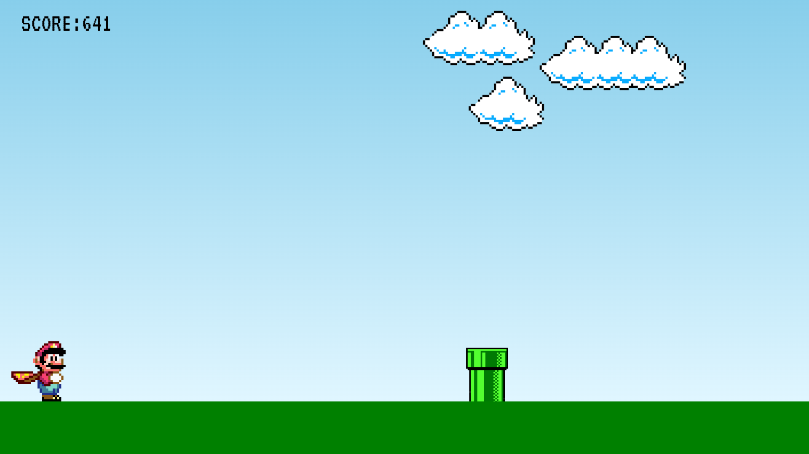

# Super-Mario-Jump-JS

# 🎮 Sobre o Alura Geek
Jogo feito com JavaScript, utilizando Gifs e animações do próprio CSS para criar a sensação de movimento, além disso toda a lógica de hitbox, morte do personagem, aumento de velocidade e nível do jogo foi desenvolvido com JavaScript, fazendo uso principalmente de estruturas condicionais.

## 📄 Apresentação do projeto

## 📁 Sobre o desenvolvimento do projeto
Parte do código do jogo é baseado no projeto do "Manual do Dev", a partir disso aprimorei o código para evitar bugs e conseguir adicionar mais features. Desde o projeto base até agora, adicionei botões para reiniciar e iniciar o jogo, funcionalidade de agachar e um novo inimigo para o Mario, o 'Bullet', e implementei mais dinâmica no game aumentando a velocidade do objetos de acordo com os pontos atingidos pelo usuário.
